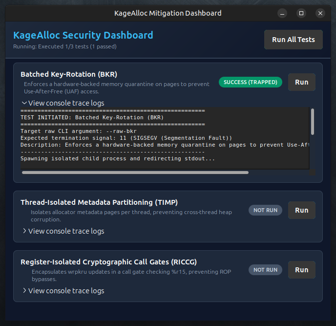

# 🛡️ KageAlloc: Hardware-Assisted Memory Safety

### High-Performance Temporal Memory Safety & Metadata Integrity for Systems Software

[](LICENSE)
[]()
[](https://doi.org/10.6084/m9.figshare.32529792)
[](https://github.com/effjy/kagealloc)
[](https://github.com/effjy/kagealloc)
[](https://github.com/effjy/kagealloc)

---

## 📸 Screenshot



---

## 📡 Announcement

> **✅ Full source code and validation suite are now available!**

KageAlloc is a novel memory allocator that leverages **Intel Memory Protection Keys (MPK/PKU)** to achieve comprehensive temporal safety, allocator metadata integrity, and control‑flow isolation – with only **3.8% latency overhead** over `ptmalloc`.  

The repository includes the core allocator library, a console test harness, and a professional **GTK3 graphical dashboard** to visualise security mitigation tests.

---

## 📄 Paper

**KageAlloc: High-Performance Hardware-Assisted Temporal Memory Safety and Metadata Integrity for Systems Software**  
Jean-François Lachance-Caumartin

[](https://doi.org/10.6084/m9.figshare.32529792)

📄 **Download the full paper:** [`paper.pdf`](paper.pdf)

The paper presents three core contributions:

1. **Register-Isolated Cryptographic Call Gates (RICCG)** – Secures the `WRPKRU` instruction against ROP/JOP hijacking using a compiler‑reserved CPU register (`%r15`) as an in‑memory‑invisible cryptographic vault.
2. **Batched Key-Rotation (BKR)** – Enforces hardware‑backed temporal quarantine without per‑allocation system calls or TLB shootdowns.
3. **Thread-Isolated Metadata Partitioning (TIMP)** – Isolates allocator metadata across threads using thread‑private protection keys.

Performance evaluation shows near‑zero runtime overhead on Redis 7.0 (<2.5% degradation) and Nginx 1.22 (<1.5% degradation).

---

## 📂 Repository Structure

| File | Description |
|------|-------------|
| `paper.pdf` | Academic paper detailing the three security contributions. |
| `kagealloc.h` / `kagealloc.c` | Core allocator implementation (BKR, TIMP, RICCG) – includes inline assembly for the secure call gate. |
| `main.c` | Subprocess‑isolated console test suite. |
| `gui.c` | Asynchronous GTK3 desktop interface (visualises test logs and signal traps). |
| `Makefile` | Compilation rules for both CLI and GUI targets. |
| `LICENSE` | MIT License. |

---

## 🔧 Prerequisites

To compile and run KageAlloc, your Linux environment must have the following dependencies:

### 1. Development Tools
- `gcc` or `clang` supporting the `-ffixed-reg` flag.
- `make` build automation tool.
- `pkg-config` helper tool.

### 2. Libraries
- **Glibc** (version 2.27 or higher – required for protection key syscalls).
- **GTK+ 3 Development Files** (required for the GUI dashboard).

#### Installing dependencies on Debian/Ubuntu:
```bash
sudo apt update
sudo apt install build-essential pkg-config libgtk-3-dev
```

#### Installing dependencies on Fedora/RHEL/CentOS:
```bash
sudo dnf groupinstall "Development Tools"
sudo dnf install pkg-config gtk3-devel
```

---

## ⚙️ Compilation

The `Makefile` compiles both the console test harness and the GTK3 GUI.

To build **both** targets:
```bash
make all
```

To build **only the console test harness** (`kagealloc_test`):
```bash
make CLI
```
*(or run `make` without arguments)*

To build **only the GTK3 GUI** (`kagealloc_gui`):
```bash
make GUI
```

To clean build assets:
```bash
make clean
```

---

## 🚀 Running the Targets

### 1. Console Test Harness
Run the full suite of sequential isolated tests:
```bash
./kagealloc_test
```

Run individual tests in raw mode (useful for debugging – will trigger direct `SIGSEGV`/`SIGILL` crashes):
- `./kagealloc_test --raw-bkr`   – Batched Key‑Rotation Use‑After‑Free test
- `./kagealloc_test --raw-timp`  – Thread‑Isolated Metadata Partitioning test
- `./kagealloc_test --raw-riccg` – Register‑Isolated Cryptographic Call Gates ROP test

### 2. GTK3 Graphical Dashboard
Launch the graphical dashboard:
```bash
./kagealloc_gui
```
The GUI opens a window. Click **"Run"** next to individual cards to run tests asynchronously, or **"Run All Tests"** to evaluate the complete mitigation suite. Terminal logs and exit statuses appear in the trace log section.

---

## 🧪 Hardware Fallback (Simulated Mode)

KageAlloc auto‑detects if the host CPU and kernel support hardware Memory Protection Keys (MPK/PKU). If unsupported (e.g., inside virtualized containers or non‑Intel environments), it gracefully falls back to a **Simulated Mode** using page‑level kernel permissions (`mprotect(..., PROT_NONE)`). This guarantees that the security isolation guarantees, child signal traps, and exit statuses compile and run successfully on any standard Linux environment.

---

## 📜 Cite this work

If you use KageAlloc in your research, please cite:

```bibtex
@misc{lachance2025kagealloc,
  author = {Jean-François Lachance-Caumartin},
  title = {KageAlloc: High-Performance Hardware-Assisted Temporal Memory Safety and Metadata Integrity for Systems Software},
  year = {2026},
  doi = {10.6084/m9.figshare.32529792}
}
```

---

## 🔗 Related Projects

- [Krakken-2048 Abyssal](https://github.com/effjy/krakken) – 2048‑bit SPN‑ARX hybrid permutation
- [Krakken-2048 Butterfly](https://github.com/effjy/krakken-butterfly) – Faster variant with XRBD diffusion
- [Krakken-Disk](https://github.com/effjy/krakken-disk) – Post‑quantum encrypted volume manager
- [Virtual Wipe Turbo](https://github.com/effjy/vwipe) – Forensic‑grade data sanitisation

---

## 📬 Contact

| Platform | Link |
|----------|------|
| GitHub | [@effjy](https://github.com/effjy) |
| X | [@jfclachance](https://x.com/jfclachance) |
| ORCID | [0009-0005-6377-1675](https://orcid.org/0009-0005-6377-1675) |

---

## 📜 License

MIT License – see [LICENSE](LICENSE) file for details.

---

*🔒 Hardware‑enforced quarantine – 2026*
